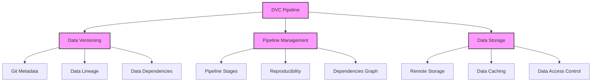
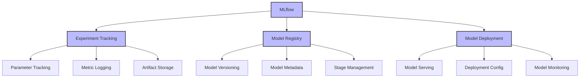
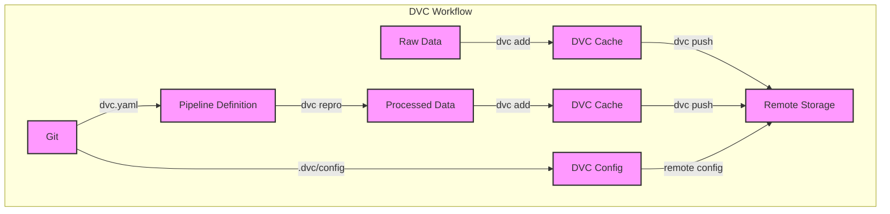
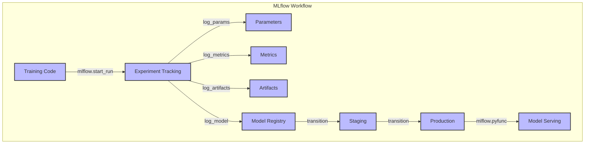

# ML-TrackHub: Data & Model Version Control

This project demonstrates the key differences between DVC (Data Version Control) and MLflow, focusing on their distinct approaches to tracking data and models in machine learning projects.

## Overview

### DVC (Data Version Control) Architecture


### MLflow Architecture


## Detailed Architecture Diagrams

### DVC Workflow Diagram


### MLflow Workflow Diagram


## Key Differences

### DVC (Data Version Control)
- Focuses on data versioning and pipeline management
- Tracks data files, directories, and ML pipelines
- Uses Git for metadata storage
- Supports remote storage for large data files
- Best for: Data versioning, reproducible pipelines, and data lineage

### MLflow
- Focuses on model lifecycle management
- Tracks experiments, parameters, and metrics
- Provides model registry and deployment tools
- Supports multiple ML frameworks
- Best for: Experiment tracking, model registry, and deployment

## Project Structure
```
.
├── data/                  # Data directory (tracked by DVC)
│   ├── raw/              # Raw data
│   └── processed/        # Processed data
├── models/               # Model artifacts (tracked by MLflow)
├── notebooks/            # Jupyter notebooks
│   └── workflow.ipynb    # Main workflow notebook
├── src/                  # Source code
│   ├── data_processing/  # Data processing scripts
│   └── model_training/   # Model training scripts
├── dvc.yaml              # DVC pipeline definition
├── requirements.txt      # Project dependencies
└── README.md            # This file
```

## Detailed Setup Instructions

1. **Clone the Repository**
```bash
git clone <repository-url>
cd ml-trackhub
```

2. **Create and Activate Virtual Environment**
```bash
# Create virtual environment
python -m venv venv

# Activate virtual environment
# On Windows:
venv\Scripts\activate
# On Unix or MacOS:
source venv/bin/activate
```

3. **Install Dependencies**
```bash
pip install -r requirements.txt
```

4. **Initialize DVC**
```bash
# Initialize DVC
dvc init

# Add data directory to DVC
dvc add data/

# Configure remote storage (optional)
dvc remote add -d myremote <remote-storage-url>
```

5. **Start MLflow Server**
```bash
# Start MLflow tracking server
mlflow server --host 0.0.0.0 --port 5000
```

6. **Run the Project**
```bash
# Generate sample data
python src/data_processing/generate_data.py

# Run DVC pipeline
dvc repro

# Train and track model with MLflow
python src/model_training/train.py
```

7. **View Results**
- DVC pipeline visualization: `dvc dag`
- MLflow UI: Open http://localhost:5000 in your browser
- Analysis report: Open `data/processed/analysis_report.html`

## Project Components Explained

### 1. Data Processing (DVC)
- **Data Generation**: Creates synthetic classification dataset
- **Data Preparation**: 
  - Feature selection using SelectKBest
  - Data transformation and cleaning
  - Feature importance visualization
- **Data Analysis**:
  - Statistical analysis
  - Correlation matrix generation
  - HTML report generation

### 2. Model Training (MLflow)
- **Experiment Tracking**:
  - Parameter logging
  - Metric tracking (accuracy, precision, recall, F1)
  - Artifact storage
- **Model Registry**:
  - Model versioning
  - Model metadata
  - Model serving

## Key Features Demonstrated

### DVC Features
- **Data Versioning**
  - Git-based metadata storage
  - Data file tracking
  - Version control for large files
- **Pipeline Management**
  - Reproducible pipelines
  - Dependency tracking
  - Pipeline visualization
- **Data Storage**
  - Remote storage integration
  - Data caching
  - Efficient data access

### MLflow Features
- **Experiment Tracking**
  - Parameter logging
  - Metric tracking
  - Artifact storage
- **Model Registry**
  - Model versioning
  - Model metadata
  - Stage management
- **Model Deployment**
  - Model serving
  - Deployment configuration
  - Model monitoring

## Requirements
- Python 3.8+
- DVC 3.27.0
- MLflow 2.10.0
- scikit-learn 1.3.0
- pandas 2.1.0
- numpy 1.24.3
- matplotlib 3.7.2
- jupyter 1.0.0

## Contributing
Please read [CONTRIBUTING.md](CONTRIBUTING.md) for details on our code of conduct and the process for submitting pull requests.

## License
This project is licensed under the MIT License - see the [LICENSE](LICENSE) file for details. 